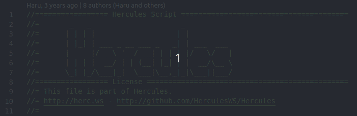
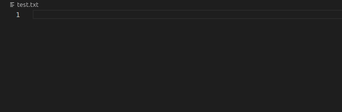
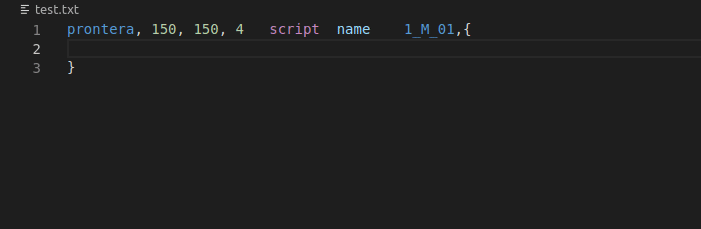
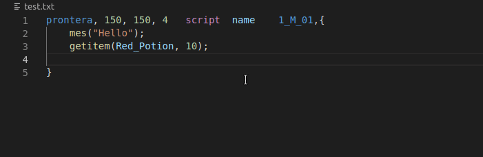
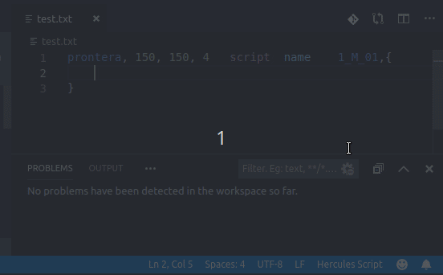

# Hercules Script Support

Adds support to Hercules' (https://herc.ws) scripting language.

## Features

### Syntax Highlighting

### Snippets/Macros

The extension comes bundled with the following snippets to speed up repetitive tasks:

|       Name         |                                     Description                                  |
|--------------------|----------------------------------------------------------------------------------|
| npc-script         | Generates a script NPC that will be in a map                                     |
| npc-script-float   | Generates a floating script NPC                                                  |
| npc-script-trigger | Generates a script NPC in a map and with Trigger area                            |
| npc-dummy-script   | Generates a script NPC with all information filled, to be used on initial setups |
| npc-warp           | Generates a warp NPC                                                             |
| func               | Generates a function header                                                      |

### Code Completion / Documentation

It gives you a list of all Hercules' commands, along with their documentation
so you can quickly write your code. Also, the current parameter is highlighted
and extra information may be available.

Completion is also provided for variables assigned in previous lines of the same NPC!

### Error Checking

Invokes map-server to execute an error checking on your script file and reports it
back to you, pointing the error line and a message explaining the problem.

**Note:** This feature requires you to setup `mapserverFolderPath` (Check [Extension Settings](#extension-settings)).

## Extension Settings

This extension contributes the following settings:

* `hercscript.mapserverFolderPath`: Allows you to set the path to an Hercules' compiled
  map-server to be used by error checking. When defined it will run this map-server everytime
  the script is saved in order to provide error information.

## Known Issues

This extension is still in beta, and it is expected for issues to show up frequently. If you run
into an issue, check our Issues page and search if someone else have already reported it, if not,
feel free to open a new issue describbing what is happening.

## Feature Requests

Have an idea of a new feature? Open an issue describbing it at length, I'll be glad to read it
and if possible it may be implemented in the future.

## Is it on VSCode Marketplace?

No. Not yet. I don't think the current state of it is stable enough for it to be published
in VSCode Marketplace.

## Release Notes

Check [CHANGELOG.md](CHANGELOG.md) files for release notes.
